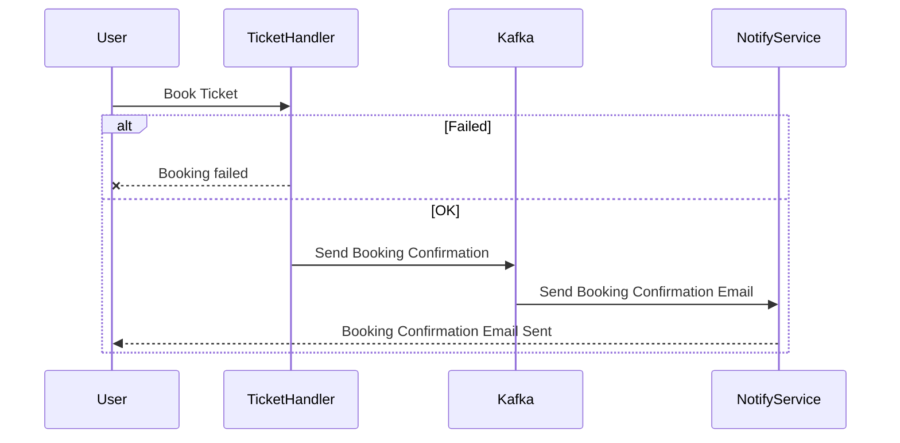

# Flight Booking API - Simple Event-Driven Architecture (Sequence Diagram)

```mermaid
sequenceDiagram

    User->>TicketHandler: Book Ticket
    alt Failed
        TicketHandler--xUser: Booking failed
    else OK
        TicketHandler->>Kafka: Send Booking Confirmation
        Kafka->>NotifyService: Send Booking Confirmation Email
        NotifyService-->>User: Booking Confirmation Email Sent
    end
    
```