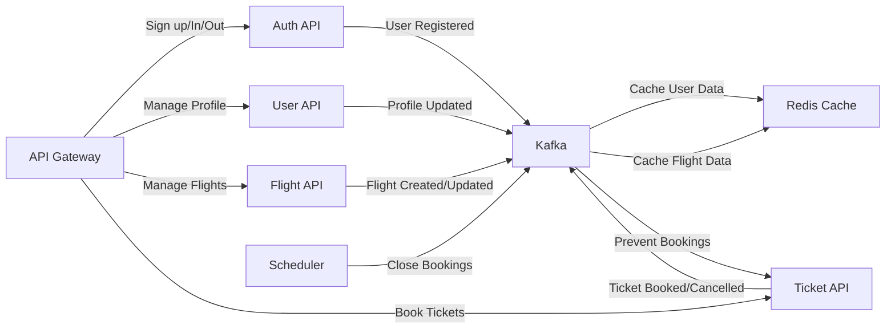

# Flight Booking API - Simplified Event-Driven Architecture

```mermaid
graph LR
    %% Components
    API[API Gateway]
    Auth[Auth API]
    User[User API]
    Flight[Flight API]
    Ticket[Ticket API]
    Kafka[Kafka]
    Redis[Redis Cache]
    Scheduler[Scheduler]

    %% User Interactions
    API -->|Sign up/In/Out| Auth
    API -->|Manage Profile| User
    API -->|Manage Flights| Flight
    API -->|Book Tickets| Ticket

    %% Event Flow
    Auth -->|User Registered| Kafka
    User -->|Profile Updated| Kafka
    Flight -->|Flight Created/Updated| Kafka
    Ticket -->|Ticket Booked/Cancelled| Kafka
    Scheduler -->|Close Bookings| Kafka

    %% Event Handling
    Kafka -->|Cache User Data| Redis
    Kafka -->|Cache Flight Data| Redis
    Kafka -->|Prevent Bookings| Ticket
```

